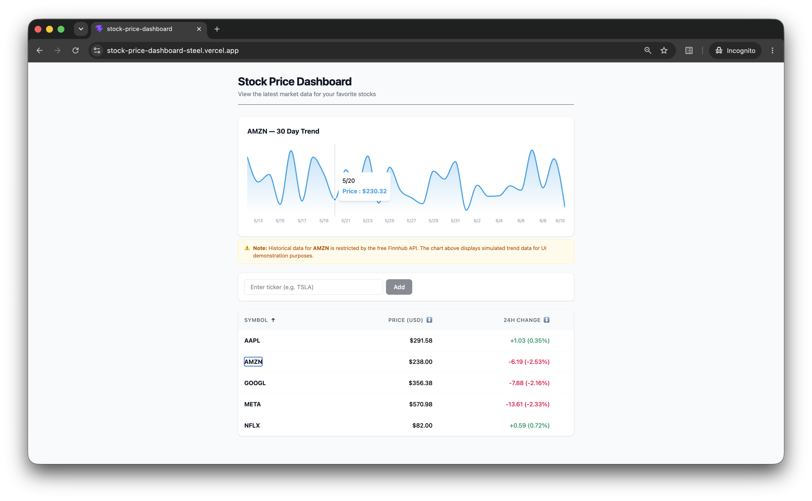

# Stock Price Dashboard

---

## Features

### Core Features
* **Real-Time Data:** Fetches live quotes using the Finnhub API.
* **Responsive UI:** Fully responsive table design built with Tailwind CSS.
* **State Management:** Robust loading, error, and empty states.
* **Type Safety:** Strict TypeScript interfaces and data validation.

### Extra Features
* **Interactive Watchlist (CRUD):** Users can dynamically search for new tickers to add to their dashboard or delete existing ones.
* **Persistent Local Storage:** The user's custom watchlist is saved to the browser's local storage, ensuring their data survives page refreshes.
* **Data Sorting:** Clickable table headers allow users to sort their watchlist by Symbol, Price, or 24h Change.
* **Historical Trend Charts:** Clicking any row reveals an interactive 30-day trend chart built with **Recharts**.
* **Graceful API Fallbacks:** To ensure a flawless UI demonstration despite Finnhub's free-tier restrictions on historical data (`403 Forbidden` / `no_data`), the app intercepts API blocks and generates realistic simulated trend data, accompanied by a transparent UI warning label.

---

## Tech Stack

* **Framework:** React 18 + Vite
* **Language:** TypeScript
* **Styling:** Tailwind CSS
* **Data Visualization:** Recharts
* **Deployment:** Vercel
